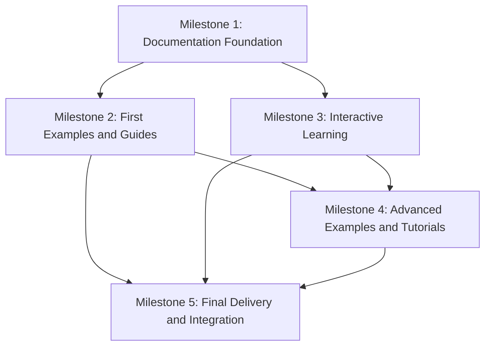

# Phase 3 Milestones: Documentation and Examples

This document provides a detailed breakdown of the milestones for Phase 3 of the WebAssembly-Optimized GitHub Actions project. Each milestone includes specific tasks, deliverables, and success criteria to track progress throughout the implementation phase.

## Overview

Phase 3 is structured around five key milestones, each building upon the previous to create a comprehensive developer experience:

1. Documentation Foundation
2. First Examples and Guides
3. Interactive Learning
4. Advanced Examples and Tutorials
5. Final Delivery and Integration

## Milestone 1: Documentation Foundation (Weeks 1-4)

The foundation milestone establishes the documentation infrastructure and core content needed to begin onboarding developers.

### Tasks

- [x] **Select Documentation Framework**
  - [x] Evaluate VitePress, Docusaurus, and other options
  - [x] Set up selected framework with basic configuration
  - [x] Implement search functionality
  - [ ] Configure automatic deployment pipeline

- [x] **Create Documentation Structure**
  - [x] Implement site navigation and information architecture
  - [x] Design consistent page templates
  - [x] Set up asset management for images and diagrams
  - [x] Create style guide for documentation content

- [x] **Develop Getting Started Guide**
  - [x] Write installation instructions
  - [x] Create basic concepts overview
  - [x] Develop quick start tutorial
  - [x] Document development environment setup

- [x] **Create Basic API Reference**
  - [x] Document core SDK functions
  - [x] Create initial event system documentation
  - [x] Document context object interfaces
  - [ ] Set up automatic TypeDoc generation

### Deliverables

1. ✅ Functioning documentation site with navigation and search
2. ✅ Documentation style guide and standards
3. ✅ Complete getting started guide
4. ✅ Initial API reference documentation
5. ✅ Basic contribution guidelines

### Success Criteria

- ✅ Documentation site is accessible and can be run locally
- ✅ New developers can follow the getting started guide to create a basic plugin
- ✅ API reference covers at least 70% of the core SDK functions
- ⬜ Documentation build pipeline is fully automated

## Milestone 2: First Examples and Guides (Weeks 5-8)

This milestone focuses on creating the first example plugins and more detailed guides to demonstrate the system's capabilities.

### Tasks

- [ ] **Develop Simple Example Plugins**
  - [ ] Create JavaScript issue responder example
  - [ ] Implement TypeScript PR analyzer example
  - [ ] Document examples with clear explanations
  - [ ] Provide step-by-step implementation guides

- [ ] **Complete API Reference Documentation**
  - [ ] Document WebAssembly bridge API
  - [ ] Create configuration options reference
  - [ ] Document utility functions
  - [ ] Add code examples for all key functions

- [ ] **Create Performance Optimization Guide**
  - [ ] Document cold start optimization techniques
  - [ ] Create memory usage optimization guide
  - [ ] Document size optimization strategies
  - [ ] Develop benchmarking guide

- [ ] **Develop Troubleshooting Guide**
  - [ ] Create common issues reference
  - [ ] Develop debugging techniques documentation
  - [ ] Create error reference with solutions
  - [ ] Document logging and diagnostics

### Deliverables

1. Two complete example plugins with documentation
2. Comprehensive API reference documentation
3. Performance optimization guide
4. Troubleshooting guide with common issues and solutions

### Success Criteria

- Examples can be run without modification
- API reference covers 100% of public interfaces
- Performance guide provides actionable optimization strategies
- Troubleshooting guide addresses the most common issues reported in Phase 1-2

## Milestone 3: Interactive Learning (Weeks 9-12)

The interactive learning milestone introduces dynamic tutorials and interactive components to enhance the learning experience.

### Tasks

- [ ] **Develop Tutorial Framework**
  - [ ] Create tutorial engine architecture
  - [ ] Implement interactive code editor component
  - [ ] Develop output viewer for results
  - [ ] Create step manager for tutorial progression

- [ ] **Create Beginner Tutorials**
  - [ ] Develop first plugin tutorial
  - [ ] Create event handling tutorial
  - [ ] Implement GitHub API integration tutorial
  - [ ] Add progress tracking for tutorial completion

- [ ] **Implement Result Visualization**
  - [ ] Create performance metrics visualization
  - [ ] Implement output display for tutorial steps
  - [ ] Develop comparison tools with baselines
  - [ ] Add interactive diagrams

- [ ] **Add Syntax Highlighting and Validation**
  - [ ] Implement syntax highlighting for JS, TS, and Rust
  - [ ] Add real-time validation of code
  - [ ] Create helpful error messages
  - [ ] Implement code completion suggestions

### Deliverables

1. Functional tutorial framework with interactive components
2. Three complete beginner tutorials
3. Result visualization for tutorial steps
4. Syntax highlighting and validation for code examples

### Success Criteria

- Users can complete tutorials entirely in the browser
- Tutorial framework provides immediate feedback on user input
- Result visualization clearly demonstrates performance benefits
- Code editor supports syntax highlighting for all supported languages

## Milestone 4: Advanced Examples and Tutorials (Weeks 13-16)

This milestone expands the example set with more complex plugins and adds advanced tutorials for experienced developers.

### Tasks

- [ ] **Develop Repository Statistics Examples**
  - [ ] Create activity dashboard plugin
  - [ ] Implement contribution analyzer plugin
  - [ ] Document data processing optimization techniques
  - [ ] Add visualization components

- [ ] **Create External Service Examples**
  - [ ] Implement JIRA integration plugin
  - [ ] Create Slack notification plugin
  - [ ] Document secure credential handling
  - [ ] Add error recovery strategies

- [ ] **Develop WASM Integration Tutorials**
  - [ ] Create WebAssembly bridge tutorial
  - [ ] Implement data passing tutorial
  - [ ] Develop WASM optimization tutorial
  - [ ] Add debugging guidance

- [ ] **Create Rust Development Tutorials**
  - [ ] Develop Rust environment setup tutorial
  - [ ] Create Rust function implementation guide
  - [ ] Document Rust optimization techniques
  - [ ] Add WASM compilation and integration tutorial

### Deliverables

1. Repository statistics example plugins
2. External service integration examples
3. WASM integration tutorials
4. Rust development tutorials

### Success Criteria

- Advanced examples demonstrate significant performance improvements with WASM
- External service examples include secure authentication patterns
- WASM tutorials enable developers to create custom optimizations
- Rust tutorials can be completed by developers with basic Rust knowledge

## Milestone 5: Final Delivery and Integration (Weeks 17-20)

The final milestone completes the documentation and examples, adds custom UI examples, and ensures all components are integrated and cross-linked.

### Tasks

- [ ] **Develop Custom UI Examples**
  - [ ] Create PR dashboard plugin
  - [ ] Implement issue visualizer plugin
  - [ ] Document UI performance optimizations
  - [ ] Add accessibility considerations

- [ ] **Complete Cross-Linking**
  - [ ] Ensure consistent navigation between sections
  - [ ] Add related content links
  - [ ] Create comprehensive index
  - [ ] Implement breadcrumb navigation

- [ ] **Optimize Search Functionality**
  - [ ] Index all content for search
  - [ ] Implement search result ranking
  - [ ] Add search filters
  - [ ] Create search suggestions

- [ ] **Finalize Documentation**
  - [ ] Conduct comprehensive technical review
  - [ ] Update content based on user feedback
  - [ ] Fix identified issues
  - [ ] Complete any missing sections

### Deliverables

1. Custom UI example plugins
2. Fully cross-linked documentation
3. Optimized search functionality
4. Complete, reviewed documentation

### Success Criteria

- All planned examples and tutorials are implemented and tested
- Documentation sections are properly cross-linked with related content
- Search functionality returns relevant results for key terms
- No sections marked as "coming soon" or incomplete

## Progress Tracking

Progress for each milestone will be tracked using GitHub Projects with the following status categories:

- **Not Started**: Task has been identified but work has not begun
- **In Progress**: Work has started on the task
- **In Review**: Task is complete and awaiting review
- **Complete**: Task has been reviewed and approved

Weekly status reports will track progress against milestones, identify blockers, and adjust timelines as needed.

## Milestone Dependencies

## Risk Management

For each milestone, the following risks have been identified with mitigation strategies:

1. **Documentation Foundation**
   - Risk: Framework selection delays
   - Mitigation: Begin with Markdown-only content that can be migrated to any framework

2. **First Examples and Guides**
   - Risk: Example complexity overwhelming users
   - Mitigation: Include progressive disclosure in examples, from simple to complex

3. **Interactive Learning**
   - Risk: Browser compatibility issues with interactive elements
   - Mitigation: Focus on widely supported features first, add progressive enhancement

4. **Advanced Examples and Tutorials**
   - Risk: Rust knowledge barriers for users
   - Mitigation: Provide complete working examples that can be used without modifications

5. **Final Delivery and Integration**
   - Risk: Content fragmentation across sections
   - Mitigation: Regular content audits and consistent navigation patterns
