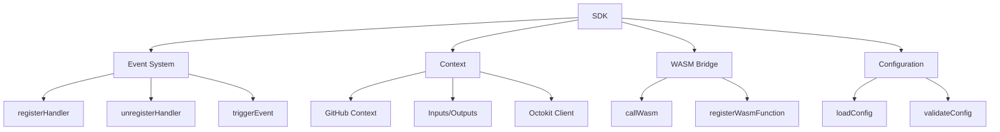

# API Reference

This section provides comprehensive documentation for the WebAssembly-Optimized GitHub Actions SDK API.

## Overview

The SDK is structured around a few core concepts:

1. **SDK Core**: The main entry point and initialization functions
2. **Event System**: Handling and responding to GitHub webhook events
3. **Context Object**: Providing access to GitHub context, inputs, and API
4. **WASM Bridge**: Interface between JavaScript and WebAssembly (advanced usage)
5. **Configuration**: Plugin configuration and metadata

## API Structure



## Core SDK Functions

### `sdk.init(options)`

Initializes the SDK with the provided options.

**Parameters:**
- `options` (Object, optional): Initialization options
  - `configPath` (string, optional): Path to the plugin configuration file. Default: `'./plugin.config.js'`
  - `enableWasm` (boolean, optional): Whether to enable WebAssembly optimizations. Default: `true`
  - `debug` (boolean, optional): Whether to enable debug logging. Default: `false`

**Returns:**
- Promise<void>: Resolves when initialization is complete

**Example:**
```javascript
const { sdk } = require('@wasm-actions/sdk');

// Initialize with default options
await sdk.init();

// Initialize with custom options
await sdk.init({
  configPath: './custom-config.js',
  enableWasm: false,
  debug: true
});
```

### `sdk.registerHandler(eventName, handler)`

Registers a handler function for a specific GitHub event.

**Parameters:**
- `eventName` (string): The name of the GitHub event (e.g., 'issues.opened')
- `handler` (Function): The handler function that will be called when the event occurs

**Handler Function Parameters:**
- `event` (Object): The GitHub webhook event object
- `context` (Object): The context object containing GitHub context, inputs, and API client

**Handler Function Returns:**
- Promise<Object>: An object containing outputs to be set

**Example:**
```javascript
const { sdk } = require('@wasm-actions/sdk');

// Register a handler for the 'issues.opened' event
sdk.registerHandler('issues.opened', async (event, context) => {
  const { issue } = event.payload;
  console.log(`Issue #${issue.number} was opened: ${issue.title}`);

  // Do something with the issue
  await context.octokit.issues.createComment({
    owner: context.repo.owner,
    repo: context.repo.repo,
    issue_number: issue.number,
    body: 'Thanks for opening this issue!'
  });

  return {
    result: `Processed issue #${issue.number}`
  };
});
```

### `sdk.unregisterHandler(eventName, handler)`

Unregisters a handler function for a specific GitHub event.

**Parameters:**
- `eventName` (string): The name of the GitHub event
- `handler` (Function, optional): The handler function to unregister. If not provided, all handlers for the event will be unregistered.

**Example:**
```javascript
const { sdk } = require('@wasm-actions/sdk');

const handler = async (event, context) => {
  // Handler implementation
};

// Register the handler
sdk.registerHandler('issues.opened', handler);

// Later, unregister the handler
sdk.unregisterHandler('issues.opened', handler);
```

## Event System

The event system handles GitHub webhook events and routes them to the appropriate handlers.

### Supported Events

The SDK supports all GitHub webhook events, including:

- `issues.opened`: Triggered when an issue is created
- `issues.edited`: Triggered when an issue is edited
- `issues.closed`: Triggered when an issue is closed
- `issues.reopened`: Triggered when an issue is reopened
- `pull_request.opened`: Triggered when a pull request is created
- `pull_request.edited`: Triggered when a pull request is edited
- `pull_request.closed`: Triggered when a pull request is closed
- `pull_request.reopened`: Triggered when a pull request is reopened
- `pull_request.synchronize`: Triggered when a pull request is updated
- `push`: Triggered when commits are pushed to a repository
- Many more...

### Event Object

The event object passed to handlers contains the GitHub webhook payload along with additional metadata:

- `name` (string): The name of the event (e.g., 'issues.opened')
- `id` (string): A unique identifier for the event
- `payload` (Object): The GitHub webhook payload
- `timestamp` (number): The timestamp when the event was received

## Context Object

The context object provides access to GitHub context, action inputs, and the GitHub API client.

### Properties

- `repo` (Object): Repository information
  - `owner` (string): Repository owner
  - `repo` (string): Repository name
- `event` (Object): GitHub event that triggered the action
- `actor` (string): GitHub username of the user who triggered the event
- `sha` (string): Commit SHA of the workflow trigger
- `ref` (string): Git reference of the workflow trigger
- `workflow` (string): Name of the workflow
- `action` (string): Name of the action
- `inputs` (Object): Inputs provided to the action
- `env` (Object): Environment variables
- `octokit` (Object): Authenticated GitHub API client

### Methods

- `setOutput(name, value)`: Sets an output value
- `debug(message)`: Logs a debug message
- `info(message)`: Logs an info message
- `warning(message)`: Logs a warning message
- `error(message)`: Logs an error message
- `setFailed(message)`: Sets the action as failed with the given message

### Example Usage

```javascript
async function handleIssueOpened(event, context) {
  // Access repository information
  const { owner, repo } = context.repo;

  // Access inputs
  const greeting = context.inputs.greeting || 'Hello';

  // Access the GitHub API
  await context.octokit.issues.createComment({
    owner,
    repo,
    issue_number: event.payload.issue.number,
    body: `${greeting}, @${event.payload.issue.user.login}!`
  });

  // Set outputs
  context.setOutput('issueNumber', event.payload.issue.number);

  // Log information
  context.info(`Processed issue #${event.payload.issue.number}`);
}
```

## More Documentation

For detailed information on specific API components, see the following pages:

- [Core SDK](./core-sdk.md)
- [Event System](./event-system.md)
- [Context Object](./context-object.md)
- [WASM Bridge](./wasm-bridge.md)
- [Configuration](./configuration.md)
