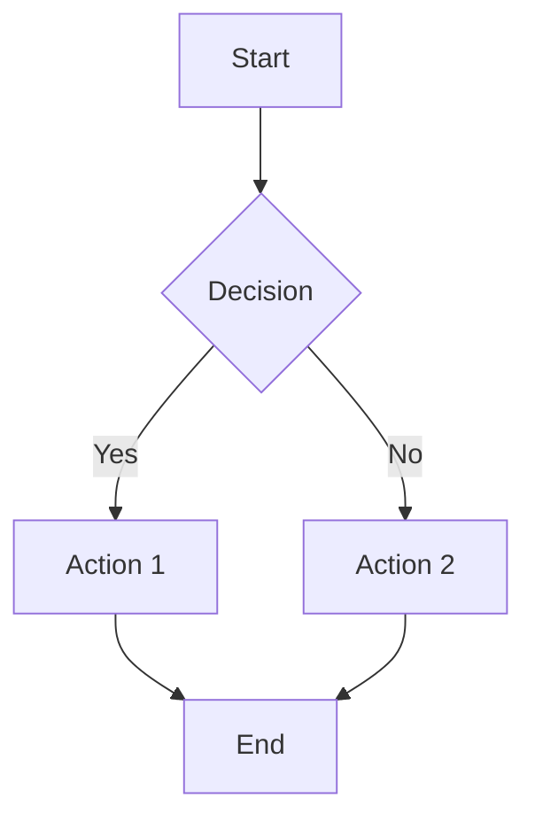

# Documentation Style Guide

This style guide establishes standards and best practices for contributing to the WebAssembly-Optimized GitHub Actions documentation. Following these guidelines ensures our documentation remains consistent, clear, and helpful for all users.

## General Principles

- **Be clear and concise**: Use simple, direct language.
- **Be accurate**: Verify all technical information.
- **Be inclusive**: Use inclusive language and examples.
- **Be consistent**: Follow the guidelines in this document.
- **Be helpful**: Anticipate user questions and provide answers.

## Document Structure

### Headers

- Use Title Case for all headers (e.g., "Getting Started Guide")
- Use headers hierarchically (H1 → H2 → H3, don't skip levels)
- Only one H1 per page, which should match the page title
- Keep headers concise, ideally under 80 characters

### Sections

- Group related content into sections with clear headers
- Use a logical progression from basic to advanced concepts
- Include introductory text for each main section
- End each page with relevant "Next Steps" or related links

## Writing Style

### Voice and Tone

- Use active voice: "The function returns a value" instead of "A value is returned by the function"
- Write in a friendly, conversational tone
- Address the reader directly using "you"
- Use present tense: "The function returns..." instead of "The function will return..."

### Formatting

- Use **bold** for UI elements and emphasis
- Use *italics* sparingly for introduced terms
- Use `code formatting` for:
  - Code snippets
  - File names
  - Function names
  - Variable names
  - Command line commands
- Use > blockquotes for important notes or tips

### Lists

- Use ordered lists (1, 2, 3) for sequential steps
- Use unordered lists (bullets) for non-sequential items
- Be consistent with punctuation in lists (either all items end with a period or none do)
- Keep list items parallel in structure

## Code Examples

### General Guidelines

- Include a brief explanation before each code example
- Keep examples simple and focused on the concept being explained
- Include comments to explain complex or non-obvious parts
- Ensure all examples are tested and working
- Show complete, runnable examples where possible

### Formatting

- Use syntax highlighting for all code blocks
- Specify the language for syntax highlighting: ```javascript
- Use 2-space indentation for all code
- Follow our code style guide for code examples
- Keep line length under 80 characters where possible

### Example Conventions

JavaScript/TypeScript:
- Use `const` and `let` instead of `var`
- Use arrow functions for simple callbacks
- Use modern JavaScript features, but note when they require a specific Node.js version
- Use async/await instead of Promise chains when appropriate

## Images and Diagrams

- Include alt text for all images
- Keep diagrams simple and focused
- Use consistent colors and styling
- Include captions for complex diagrams
- Use SVG format for diagrams when possible
- Ensure text in diagrams is readable at different screen sizes

## Links

- Use descriptive link text: "See the [installation guide]()" instead of "Click [here]()"
- Link to relevant documentation when introducing new concepts
- Check that all links work and point to the correct destination
- Use relative links for internal documentation
- Use the correct base URL format for relative links: `/category/page` not `../category/page`

## API Documentation

- Document all parameters with type information and descriptions
- Include return type and description
- Document exceptions and errors that may be thrown
- Provide usage examples for each API element
- Group related API elements together
- Document default values for optional parameters

## Versioning

- Clearly indicate when features are version-specific
- Use admonitions or notes to highlight version requirements
- Avoid documenting unreleased or experimental features in the main documentation

## Inclusive Language

- Use gender-neutral terms: "they" instead of "he/she"
- Avoid terms with negative connotations or historical baggage
- Use inclusive examples that feature diverse personas
- Avoid culture-specific references or idioms that may not translate globally
- Consider and respect the global, diverse audience

## File Naming Conventions

- Use kebab-case for all documentation files: `getting-started.md` not `gettingStarted.md`
- Use meaningful, descriptive file names
- Group related files in directories
- Use consistent file extensions (.md)

## Mermaid Diagrams

We use [Mermaid](https://mermaid-js.github.io/mermaid/) for diagrams in our documentation.

- Use Mermaid for flowcharts, sequence diagrams, class diagrams, etc.
- Keep diagrams simple and focused
- Include alt text descriptions
- Use consistent styling
- Follow this format for Mermaid diagrams:



## Review Process

All documentation should go through the following review process:

1. **Technical accuracy review**: Ensure all technical information is correct
2. **Style guide compliance review**: Check adherence to this style guide
3. **Copy editing**: Check grammar, spelling, punctuation, and clarity
4. **User testing**: Validate that the documentation is helpful and understandable

## Examples

### Good Example

```markdown
# Creating Your First Plugin

This guide will walk you through creating your first GitHub Action plugin with our SDK.

## Prerequisites

Before you begin, ensure you have:

- Node.js v16 or higher installed
- Basic knowledge of JavaScript
- Git installed

## Step 1: Initialize Your Project

Create a new directory and initialize your project:

```bash
mkdir my-first-plugin
cd my-first-plugin
npm init -y
```

## Step 2: Install the SDK

Install our SDK using npm:

```bash
npm install @wasm-actions/sdk
```
```

### Bad Example

```markdown
# Plugin Creation

Here's how to create plugins.

Install Node.js first.

Run these:
mkdir my-first-plugin
cd my-first-plugin
npm init -y

Then install SDK:
npm install @wasm-actions/sdk
```

## Common Mistakes to Avoid

- Inconsistent capitalization in headers
- Mixing first, second, and third person perspective
- Unexplained acronyms or technical terms
- Incomplete or unclear examples
- Missing steps in tutorials
- Outdated information
- Broken links
- Overly complex explanations for simple concepts
- Lack of visual aids for complex concepts
- Assuming too much prior knowledge
