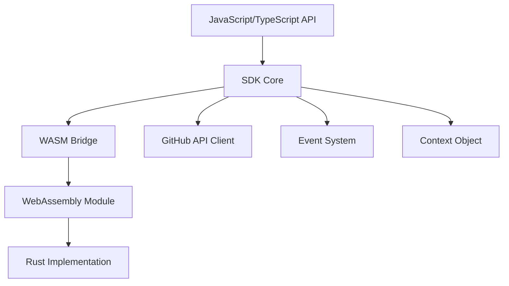
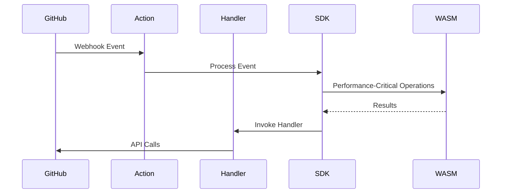

# Basic Concepts

This guide introduces the core concepts of the WebAssembly-Optimized GitHub Actions SDK. Understanding these concepts will help you build effective and high-performance plugins.

## Architecture Overview

Our SDK is built on a layered architecture that balances developer experience with performance:



### Key Components

1. **JavaScript/TypeScript API**: The public API that you interact with as a developer
2. **SDK Core**: Handles the core logic of the SDK, including event routing and context management
3. **WASM Bridge**: Facilitates communication between JavaScript and WebAssembly
4. **WebAssembly Module**: Contains optimized code compiled from Rust
5. **GitHub API Client**: Provides access to the GitHub API
6. **Event System**: Handles webhook events from GitHub
7. **Context Object**: Provides access to inputs, environment variables, and GitHub context

## Plugin Structure

A GitHub Action plugin built with our SDK typically consists of:

1. **Configuration File**: Defines metadata, inputs, outputs, and events
2. **Event Handlers**: Functions that respond to specific GitHub events
3. **Main Entry Point**: Initializes the SDK and registers event handlers

## Event-Driven Model

Our SDK is built around an event-driven model, where your code responds to GitHub webhook events:



### Common Events

- `issues.opened`: Triggered when an issue is created
- `issues.edited`: Triggered when an issue is edited
- `pull_request.opened`: Triggered when a pull request is created
- `pull_request.synchronize`: Triggered when a pull request is updated
- `push`: Triggered when commits are pushed to a repository

## Context Object

The context object provides access to:

1. **GitHub Context**: Information about the repository, event, and actor
2. **Action Inputs**: Inputs defined in the plugin configuration
3. **Environment Variables**: Access to environment variables
4. **GitHub API Client**: An authenticated Octokit instance for GitHub API calls

Example usage:

```javascript
function handleEvent(event, context) {
  // Access GitHub context
  const { repo, actor } = context;

  // Access inputs
  const greeting = context.inputs.greeting || "Hello";

  // Access environment variables
  const token = context.env.GITHUB_TOKEN;

  // Make GitHub API calls
  return context.octokit.issues.createComment({
    owner: repo.owner,
    repo: repo.name,
    issue_number: event.payload.issue.number,
    body: `${greeting}, @${actor}!`
  });
}
```

## WebAssembly Optimization

Our SDK uses WebAssembly to optimize performance-critical operations, particularly to reduce cold start times:

### Key Optimization Techniques

1. **WASM Inlining**: WebAssembly binary is inlined as base64-encoded string to eliminate disk I/O
2. **Lazy Initialization**: WebAssembly module is only initialized when needed
3. **Optimized Memory Management**: Efficient handling of data between JavaScript and WebAssembly
4. **Parallelization**: Certain operations are parallelized using WebAssembly threads

These optimizations are mostly transparent to Tier 1 developers but can be configured and extended by Tier 2 and Tier 3 developers.

## Plugin Configuration

The plugin configuration defines your plugin's metadata, events, inputs, and outputs:

```javascript
// plugin.config.js
module.exports = {
  name: "issue-labeler",
  description: "Automatically labels issues based on content",
  author: "Your Name",
  events: ["issues.opened", "issues.edited"],
  inputs: {
    configuration_path: {
      description: "Path to the label configuration",
      required: false,
      default: ".github/labeler.yml"
    }
  },
  outputs: {
    labels_added: {
      description: "Labels that were added to the issue"
    }
  },
  branding: {
    icon: "tag",
    color: "blue"
  }
};
```

This configuration is used to:

1. Generate the `action.yml` file required by GitHub Actions
2. Register event handlers
3. Validate inputs and outputs
4. Provide metadata for the GitHub Marketplace

## Next Steps

Now that you understand the basic concepts, you're ready to move on to the [Quick Start Guide](./quick-start.md) to create your first plugin.
