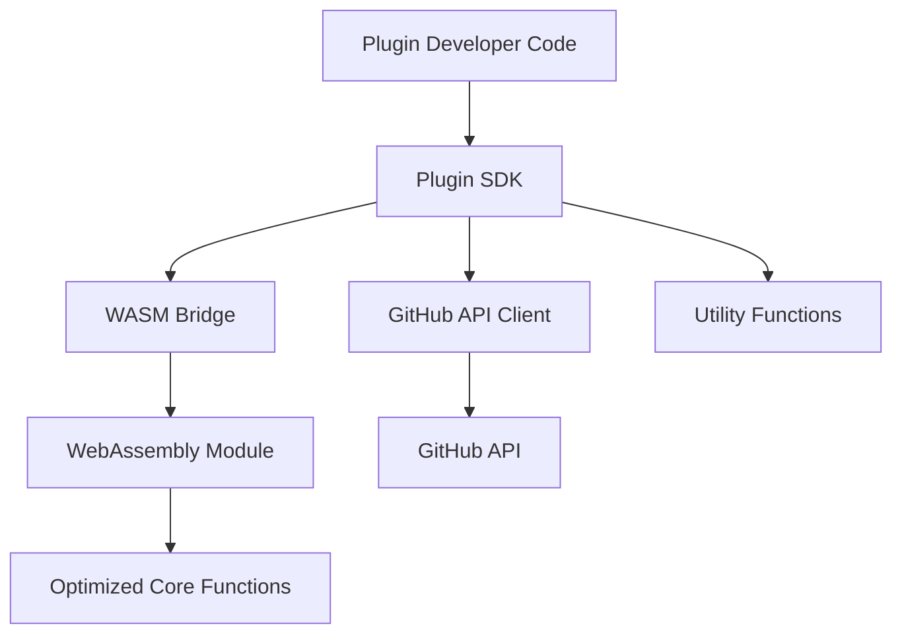

# Phase 1 Implementation Plan: Core Abstractions

This document provides a detailed implementation plan for Phase 1 of our developer experience roadmap, focusing on core abstractions that will make our WebAssembly-optimized GitHub Actions more accessible to developers.

## 1. Plugin SDK Abstraction Layer

### 1.1 SDK Architecture



### 1.2 Core Components

#### 1.2.1 Event System

The event system will provide a simple way to register handlers for GitHub webhook events:

```typescript
// src/sdk/events.ts
import { PluginContext } from './context';

export type EventPayload = Record<string, any>;

export type EventHandler<T extends EventPayload = EventPayload> = (
  payload: T,
  context: PluginContext
) => Promise<void> | void;

export interface EventRegistry {
  on<T extends EventPayload>(event: string, handler: EventHandler<T>): void;
  once<T extends EventPayload>(event: string, handler: EventHandler<T>): void;
  off(event: string, handler?: EventHandler): void;
}

class EventManager implements EventRegistry {
  private handlers: Map<string, Set<EventHandler>> = new Map();

  on<T extends EventPayload>(event: string, handler: EventHandler<T>): void {
    if (!this.handlers.has(event)) {
      this.handlers.set(event, new Set());
    }
    this.handlers.get(event)!.add(handler);
  }

  once<T extends EventPayload>(event: string, handler: EventHandler<T>): void {
    const onceHandler: EventHandler = async (payload, context) => {
      await handler(payload, context);
      this.off(event, onceHandler);
    };
    this.on(event, onceHandler);
  }

  off(event: string, handler?: EventHandler): void {
    if (!handler) {
      this.handlers.delete(event);
      return;
    }

    const handlers = this.handlers.get(event);
    if (handlers) {
      handlers.delete(handler);
      if (handlers.size === 0) {
        this.handlers.delete(event);
      }
    }
  }

  async trigger(event: string, payload: EventPayload, context: PluginContext): Promise<void> {
    const handlers = this.handlers.get(event);
    if (!handlers) return;

    const promises = Array.from(handlers).map(handler => handler(payload, context));
    await Promise.all(promises);
  }
}

export const events = new EventManager();
```

#### 1.2.2 Context Object

The context object will provide access to GitHub API, environment variables, and utility functions:

```typescript
// src/sdk/context.ts
import { Octokit } from '@octokit/rest';
import { getEnvironment } from './environment';
import { wasmUtils } from './wasm-utils';

export interface GitHubAPI {
  octokit: Octokit;
  repo: { owner: string; repo: string };
  createComment(issueNumber: number, body: string): Promise<void>;
  createIssue(title: string, body: string, labels?: string[]): Promise<number>;
  // Add more GitHub API methods as needed
}

export interface PluginEnvironment {
  stateId: string;
  eventName: string;
  eventPayload: string;
  settings: string;
  authToken: string;
  ref: string;
  signature: string;
  command: string;
  pluginGithubToken: string;
  kernelPublicKey: string;
  logLevel: string;
  supabaseUrl: string;
  supabaseKey: string;
}

export interface PluginUtils {
  parseJSON<T>(json: string): T;
  validatePayload(schema: any, payload: any): boolean;
  computeHash(data: string): string;
  // Add more utility functions as needed
}

export interface PluginContext {
  github: GitHubAPI;
  env: PluginEnvironment;
  utils: PluginUtils;
  log(message: string, level?: 'info' | 'warn' | 'error'): void;
}

export function createContext(): PluginContext {
  const env = getEnvironment();

  // Create Octokit instance
  const octokit = new Octokit({
    auth: env.pluginGithubToken,
  });

  // Extract repository information from the event payload
  const eventPayload = JSON.parse(env.eventPayload || '{}');
  const repo = {
    owner: eventPayload.repository?.owner?.login || '',
    repo: eventPayload.repository?.name || '',
  };

  // Create GitHub API client
  const github: GitHubAPI = {
    octokit,
    repo,
    async createComment(issueNumber, body) {
      await octokit.issues.createComment({
        ...repo,
        issue_number: issueNumber,
        body,
      });
    },
    async createIssue(title, body, labels = []) {
      const response = await octokit.issues.create({
        ...repo,
        title,
        body,
        labels,
      });
      return response.data.number;
    },
    // Add more GitHub API methods as needed
  };

  // Create context object
  return {
    github,
    env,
    utils: wasmUtils,
    log(message, level = 'info') {
      const timestamp = new Date().toISOString();
      console.log(`[${timestamp}] [${level.toUpperCase()}] ${message}`);
    },
  };
}
```

#### 1.2.3 WASM Bridge

The WASM bridge will connect JavaScript and Rust:

```typescript
// src/sdk/wasm-bridge.ts
import { instantiateWasmFromBase64 } from '../wasm-inline';

// Define the interface for WASM exports
interface WasmExports {
  process_event: (envJson: string) => string;
  parse_json: (json: string) => string;
  validate_payload: (schema: string, payload: string) => number;
  compute_hash: (data: string) => string;
  // Add more WASM exports as needed
}

// Initialize WASM module
let wasmInstance: WebAssembly.Instance | null = null;
let wasmExports: WasmExports | null = null;

export async function initWasm(wasmBase64: string): Promise<void> {
  if (wasmInstance) return;

  try {
    // Create import object for WASM
    const importObject = {
      env: {},
      console: {
        log: (ptr: number, len: number) => {
          // This will be implemented by the WASM module
          console.log("WASM log:", ptr, len);
        }
      }
    };

    // Instantiate WASM module
    wasmInstance = await instantiateWasmFromBase64(wasmBase64, importObject);
    wasmExports = wasmInstance.exports as unknown as WasmExports;

    console.log("WebAssembly initialized successfully");
  } catch (error) {
    console.error("Failed to initialize WebAssembly:", error);
    throw error;
  }
}

export function getWasmExports(): WasmExports {
  if (!wasmExports) {
    throw new Error("WebAssembly not initialized. Call initWasm() first.");
  }
  return wasmExports;
}
```

#### 1.2.4 Utility Functions

Utility functions will leverage WASM for performance:

```typescript
// src/sdk/wasm-utils.ts
import { getWasmExports } from './wasm-bridge';

export const wasmUtils = {
  parseJSON<T>(json: string): T {
    try {
      // Try to use WASM implementation if available
      try {
        const exports = getWasmExports();
        const result = exports.parse_json(json);
        return JSON.parse(result) as T;
      } catch (wasmError) {
        // Fall back to native implementation
        console.warn("WASM parse_json failed, using native implementation:", wasmError);
        return JSON.parse(json) as T;
      }
    } catch (error) {
      throw new Error(`Failed to parse JSON: ${error}`);
    }
  },

  validatePayload(schema: any, payload: any): boolean {
    try {
      // Try to use WASM implementation if available
      try {
        const exports = getWasmExports();
        const schemaStr = JSON.stringify(schema);
        const payloadStr = JSON.stringify(payload);
        const result = exports.validate_payload(schemaStr, payloadStr);
        return result === 1;
      } catch (wasmError) {
        // Fall back to native implementation
        console.warn("WASM validate_payload failed, using native implementation:", wasmError);
        // Simple validation logic as fallback
        return true; // Replace with actual validation logic
      }
    } catch (error) {
      throw new Error(`Failed to validate payload: ${error}`);
    }
  },

  computeHash(data: string): string {
    try {
      // Try to use WASM implementation if available
      try {
        const exports = getWasmExports();
        return exports.compute_hash(data);
      } catch (wasmError) {
        // Fall back to native implementation
        console.warn("WASM compute_hash failed, using native implementation:", wasmError);
        // Simple hash function as fallback
        let hash = 0;
        for (let i = 0; i < data.length; i++) {
          hash = ((hash << 5) - hash) + data.charCodeAt(i);
          hash |= 0; // Convert to 32bit integer
        }
        return hash.toString(16);
      }
    } catch (error) {
      throw new Error(`Failed to compute hash: ${error}`);
    }
  },

  // Add more utility functions as needed
};
```

#### 1.2.5 Main SDK Entry Point

The main SDK entry point will provide a simple API for plugin developers:

```typescript
// src/sdk/index.ts
import { WASM_BASE64 } from '../wasm-inline';
import { events, EventHandler, EventPayload } from './events';
import { createContext, PluginContext } from './context';
import { initWasm } from './wasm-bridge';
import { wasmUtils } from './wasm-utils';

// Initialize the SDK
let initialized = false;
let context: PluginContext | null = null;

export async function init(): Promise<void> {
  if (initialized) return;

  // Initialize WASM
  await initWasm(WASM_BASE64);

  // Create context
  context = createContext();

  initialized = true;
}

// Event registration
export function on<T extends EventPayload>(event: string, handler: EventHandler<T>): void {
  events.on(event, handler);
}

export function once<T extends EventPayload>(event: string, handler: EventHandler<T>): void {
  events.once(event, handler);
}

export function off(event: string, handler?: EventHandler): void {
  events.off(event, handler);
}

// Get context
export function getContext(): PluginContext {
  if (!context) {
    throw new Error("SDK not initialized. Call init() first.");
  }
  return context;
}

// Export utility functions
export const utils = wasmUtils;

// Export types
export type { EventPayload, EventHandler, PluginContext };
```

### 1.3 Implementation Steps

1. **Create SDK Directory Structure**
   ```
   src/
   ├── sdk/
   │   ├── index.ts
   │   ├── events.ts
   │   ├── context.ts
   │   ├── environment.ts
   │   ├── wasm-bridge.ts
   │   └── wasm-utils.ts
   ├── wasm-inline.ts
   ├── wasm-wrapper.ts
   └── index.ts
   ```

2. **Update Rust WASM Module**
   - Add new exported functions for utility operations
   - Optimize memory usage for common operations
   - Implement error handling and reporting

3. **Update Build Process**
   - Ensure SDK files are properly bundled
   - Generate TypeScript type definitions
   - Create minified production build

4. **Create Tests**
   - Unit tests for each SDK component
   - Integration tests for the full SDK
   - Performance benchmarks

5. **Create Documentation**
   - API reference for SDK
   - Usage examples
   - Performance considerations

## 2. Tiered Development Model

### 2.1 Directory Structure

```
templates/
├── tier1-js/
│   ├── src/
│   │   ├── index.js
│   │   └── handlers/
│   ├── action.yml
│   └── package.json
├── tier2-ts/
│   ├── src/
│   │   ├── index.ts
│   │   ├── wasm-config.ts
│   │   └── handlers/
│   ├── action.yml
│   ├── package.json
│   └── tsconfig.json
└── tier3-rust/
    ├── src/
    │   ├── index.ts
    │   └── handlers/
    ├── wasm/
    │   ├── src/
    │   │   └── lib.rs
    │   └── Cargo.toml
    ├── action.yml
    ├── package.json
    └── tsconfig.json
```

### 2.2 Implementation Steps

1. **Create Template Directories**
   - Set up the directory structure for each tier
   - Create base files for each template

2. **Implement Tier 1 (JavaScript Only)**
   - Create simple JavaScript API
   - Pre-compile WASM module
   - Implement hook-based programming model

3. **Implement Tier 2 (TypeScript + WASM)**
   - Create TypeScript interfaces
   - Implement WASM configuration options
   - Add performance monitoring

4. **Implement Tier 3 (Full Stack with Rust)**
   - Set up Rust development environment
   - Create extension points for Rust code
   - Implement advanced performance tuning

5. **Create Migration Paths**
   - Document how to migrate between tiers
   - Create migration scripts
   - Implement automatic detection of tier

## 3. Configuration System

### 3.1 Configuration File Format

```typescript
// plugin.config.ts
export default {
  // Basic plugin information
  name: 'My Awesome Plugin',
  description: 'This plugin does something awesome',
  author: 'Your Name',

  // GitHub Action configuration
  action: {
    icon: 'code',
    color: 'blue',
    inputs: {
      // Define custom inputs here
      customSetting: {
        description: 'A custom setting for the plugin',
        required: false,
        default: 'default value'
      }
    },
    outputs: {
      // Define outputs here
      result: {
        description: 'The result of the plugin execution'
      }
    }
  },

  // Performance optimization settings
  optimization: {
    useWasm: true,
    wasmFunctions: ['parseJSON', 'validatePayload', 'computeHash'],
    lazyLoad: ['@octokit/rest', 'jsonwebtoken']
  },

  // Event handlers
  events: {
    'issue.opened': './src/handlers/issue-opened.ts',
    'pull_request.created': './src/handlers/pull-request-created.ts'
  }
};
```

### 3.2 Implementation Steps

1. **Design Configuration Schema**
   - Define JSON schema for configuration
   - Create TypeScript interfaces
   - Implement validation

2. **Create Configuration Parser**
   - Implement configuration loading
   - Validate against schema
   - Provide helpful error messages

3. **Implement File Generators**
   - Generate action.yml from configuration
   - Create entry point file
   - Generate type definitions

4. **Create Runtime Configuration Loader**
   - Load configuration at runtime
   - Apply optimization settings
   - Register event handlers

## Timeline and Milestones

### Week 1-2: SDK Design and Planning
- [ ] Finalize SDK architecture
- [ ] Create detailed interface definitions
- [ ] Design WASM bridge API
- [ ] Plan tiered development model

### Week 3-4: Core SDK Implementation
- [ ] Implement event system
- [ ] Create context object
- [ ] Develop WASM bridge
- [ ] Implement utility functions

### Week 5-6: Tiered Development Model
- [ ] Create template directories
- [ ] Implement Tier 1 (JavaScript Only)
- [ ] Implement Tier 2 (TypeScript + WASM)
- [ ] Implement Tier 3 (Full Stack with Rust)

### Week 7-8: Configuration System
- [ ] Design configuration schema
- [ ] Implement configuration parser
- [ ] Create file generators
- [ ] Develop runtime configuration loader

### Week 9-10: Testing and Documentation
- [ ] Write unit tests
- [ ] Create integration tests
- [ ] Develop performance benchmarks
- [ ] Write documentation

### Week 11-12: Refinement and Release
- [ ] Address feedback
- [ ] Optimize performance
- [ ] Prepare for release
- [ ] Create examples

## Success Criteria

- SDK provides a simple API for plugin developers
- Tiered development model accommodates different skill levels
- Configuration system simplifies plugin creation
- Performance is maintained or improved
- Documentation is comprehensive and clear
